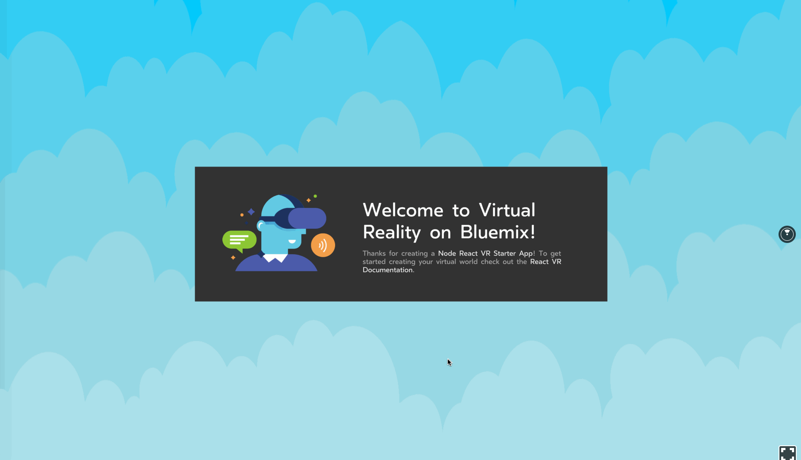

# Bluemix React VR Starter

This project is designed to get you up and running quickly with a light-weight React VR experience hosted in the cloud that you can share with everyone.

<p align="center">
  
</p>

If you want to save the tutorial for later (or already know what you're doing and want it hosted quickly) You can use this handy button to do a quick deploy.

<p align="center">
    <a href="https://bluemix.net/deploy?repository=https://github.com/craigkj312/node-react-vr-starter&branch=master"></a>
</p>

## Before You Begin

Things you'll need:
* [Bluemix account](https://console.ng.bluemix.net/registration/)
* [Cloud Foundry CLI](https://github.com/cloudfoundry/cli#downloads)
* [Node](https://nodejs.org/en/)

## 1. Clone the App

To start, clone this repository locally on your machine.

  ```
  git clone https://github.com/craigkj312/node-react-vr-starter && cd node-react-vr-starter
  ```

Now that you have the code locally you should take a moment to look through the project a bit. Here is a basic explanation of the more important files:

```
.
├── src                                 // The un-bundled code of the VR app.
│   ├── components                      // Any React VR components used in the app.
│   │   └── infoPanel.component.vr.js   // An example React VR component that displays a View with an Image and Text.
│   └── styles                          // Styling for the React VR components.
│       └── main.stylesheet.js          // An example React VR StyleSheet which styles the InfoPanel.
├── vr                                  // Contains the bundled React VR app.
│   ├── build                           // The actual bundled js files are in here.
│   ├── static_assets                   // Any static assets (like images) that the app uses go in here.
│   ├── client.js                       // Client-side configuration that launches the bundled React VR app.
│   └── index.html                      // The index file which wraps the bundled React VR app.
├── index.vr.js                         // The main React VR component which acts as the base of the React VR app.
├── manifest.yml                        // The configuration file which tells Cloud Foundary how to upload your app.
├── package.json                        // Lists basic project information and is used to install required packages.
├── rn-cli.config.js                    // Configuration file for the React packager. 
└── server.js                           // The main node server file which hosts the static content.
```

## 2. Run the App

Install the dependencies from the [package.json](https://docs.npmjs.com/files/package.json) file.
  ```
  npm install
  ```
(_Note:_ `yarn install` may also be used if you have [yarn](https://yarnpkg.com/en/))

Bundle the React VR app. This repository contains a pre-bundled build of the app, but this is good to know for when you start making changes to the code.
  ```
  npm run build
  ```

Run the app.
  ```
  npm start  
  ```

View your app at: http://localhost:3000

## 3a. Deploy the App

Before deploying to Bluemix you'll need to make some modifications to the [manifest.yml](mainfest.yml) file. Open it up and change the `name` field to be whatever you wish to call your new app.
 
 ```
 applications:
 - name: <Your-App-Name>
   random-route: true
   memory: 128M
 ```

The [manifest.yml](mainfest.yml) file has a lot of different configuration options. One of the most important is the ability to set a specific route. If you'd like to learn how, you can check our documentation [here](https://console.bluemix.net/docs/manageapps/depapps.html#appmanifest).

Next we'll be using the Cloud Foundary CLI to push our application.

Choose your API endpoint.
   ```
   cf api <API-endpoint>
   ```

Replace the *API-endpoint* in the command with an API endpoint from the following list.
  ```
  https://api.ng.bluemix.net # US South
  https://api.eu-gb.bluemix.net # United Kingdom
  https://api.au-syd.bluemix.net # Sydney
  ```

Login to your Bluemix account.
  ```
  cf login
  ```

From within the *node-react-vr-starter* directory push your app to Bluemix.
  ```
  cf push
  ```
(_Note:_ After making changes to the app, you need run `npm run build` before your `cf push` to bundle your app for hosting.)

This can take a minute. If there is an error in the deployment process you can use the command `cf logs <Your-App-Name> --recent` to troubleshoot.

## 3b. Container Deployment

This repository also contains a [Dockerfile](Dockerfile) that allows you to build a Docker container image. This container image can be uploaded to a platform of your choice by following one of these docs:

* [Bluemix](https://console.ng.bluemix.net/docs/containers/container_single_ui.html#container_gettingstarted_tutorial)
* [AWS](https://aws.amazon.com/getting-started/tutorials/deploy-docker-containers/)
* [Azure](https://docs.microsoft.com/en-us/azure/container-service/container-service-docker-swarm)
* [Google Cloud Platform](https://cloud.google.com/container-engine/docs/)

If you just want to run in a container locally you can follow these steps:

First download and install the [Docker Tools](https://docs.docker.com/engine/installation/). Once you have that done you'll want to run the following command in the same directory as the [Dockerfile](Dockerfile).
```
docker build -t <your username>/react-vr-app .
```

This will build a docker image that will live locally. To check your images you can use:
```
docker images
```

Assuming you see your newly built image in that list you can then use the following command to run your container locally.
```
docker run -p 3000:3000 -d <your username>/react-vr-app
```

Now you should be able to view your app at: http://localhost:3000

You can also verify that your container is running with the command:
```
docker ps
```

For more information about Docker containers check out the [Docker Documentaion](https://docs.docker.com/get-started/)

## 4. Next Steps

That's it! You now have a Virtual Reality application running live on Bluemix (or somewhere of your choosing). Start sharing the link with your friends!

Ok, maybe you want to make a few changes to the app first. In that case I would recommend checking out the [React VR Documentation](https://facebook.github.io/react-vr/docs/getting-started.html). It has a lot of great content and should help you get up to speed developing your app. If you aren't familiar with common React programming patterns, you can also check out the [React Documentation](https://facebook.github.io/react/).

If you have more questions about Bluemix, or would like to know what services can be added to your app, you can check out the [Bluemix Documentation](https://console.bluemix.net/docs/).

# License
This project is licensed under Apache 2.0. Full license text is available in [LICENSE](LICENSE).
